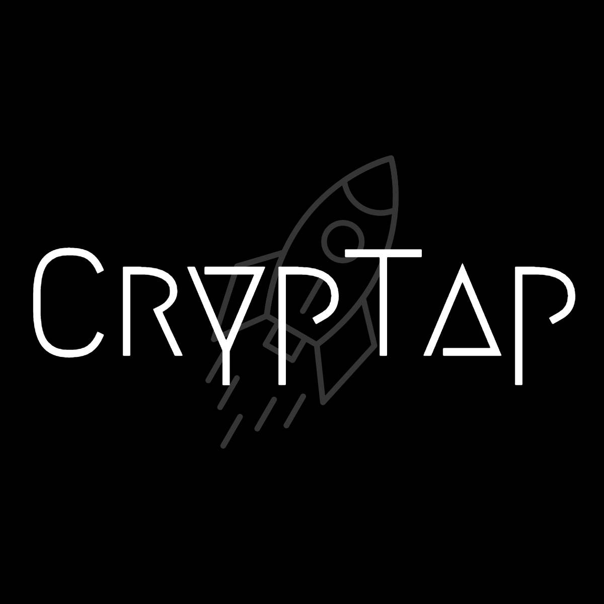

# 🚀 CrypTap: Crypto Payments at a Tap 🚀

**Unlock the power of NFC for crypto payments. Share crypto, NFTs, and more with just a tap.**

## 🌟 Built With Excellence:

CrypTap is a testament to the power of blockchain technology, delivered through a user-friendly NFC interface.

### 🛠 Linea
Experience rapid and cost-effective transactions with Linea's Goerli TestNet.

### 🔐 Metamask SDK
Metamask's SDK empowers seamless integration for wallet functionalities across platforms.

### 🛡 Harpie
Harpie safeguards transactions by ensuring the integrity of sender addresses.

## 🚀 How It Works:

1. **Initiate**: Begin your transaction on CrypTap with a selection of the ETH amount.
2. **Share**: A secure link for the transaction is generated, shareable via NFC.
3. **Verify & Transact**: Transactions are verified for integrity before completion, providing peace of mind with every transfer.

## 📚 Documentation & Live Demo

Get a deeper understanding of CrypTap's functionalities by visiting our [documentation](https://link_to_your_documentation). Or experience the platform firsthand with our [**live demo**](https://ethdenver-smoky.vercel.app/).

## 📝 License

CrypTap is open-sourced software licensed under the [MIT License](https://opensource.org/licenses/MIT).

---

Crafted with ❤️ by the CrypTap Team.

